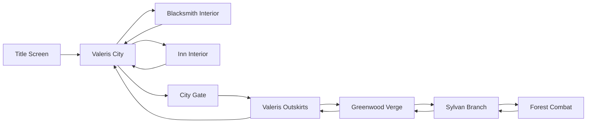

# v1.4 JRPG Experience Bible

Status: Draft implementation contract
Date: 2026-06-21

## Direction

Yggdrasil Chronicles v1.4 should read as an original, license-safe 16-bit fantasy JRPG vertical slice. The world should feel authored: clear paths, visible entrances, layered foreground/background separation, local landmarks, and area-specific mood. AI remains cosmetic only.

## Visual Language

- Pixel-art scale: chunky, readable, low-noise shapes.
- Camera: active map fills the viewport; no black void around playable space.
- Paths: roads and trails visibly guide the next destination.
- Entrances: doors, gates, counters, and service NPCs are physically readable.
- Foreground: trees, roofs, counters, and walls can overlap the player only when depth remains clear.
- UI: compact HUD, contextual prompt, intentional overlays only.
- Audio: each map owns a BGM key; missing audio fails silently without blocking play.

## Core Maps

### Valeris City - Safe Hub

Warm medieval town. Cobblestone plaza, road cross, blacksmith facade, inn facade, city gate, lanterns, walls, small fountain, and NPC gathering points. Hagar belongs at the blacksmith entrance/interior. Elena belongs inside the inn. Kael belongs near the route out.

### Blacksmith Interior

Forge room with orange light, anvil, counter, tool shelves, workbench, coal pile, and Hagar behind or near the counter. The shop service belongs only to Hagar.

### Inn Interior

Warm tavern room with reception desk, hearth, tables, beds, storage, and Elena at the desk. Rest service belongs only to Elena.

### Valeris Outskirts

City gate exit into safer countryside. Dirt path, grass, fences, stones, sparse trees, and the route toward Greenwood Verge. First danger markers should sit off the path.

### Greenwood Verge

Transition biome. Denser vegetation, narrower trail, signs, roots, and darker edge foliage. Player should feel safe territory receding.

### Sylvan Branch

Dense forest. Roots, rocks, uneven path, enclosed tree walls, and a stronger danger palette. Forest combat background should match this biome.

## Transition Graph

## Spawn Plan

| Map | Spawn | Exit/Interaction Points |
|---|---:|---|
| Valeris City | 780, 560 | Blacksmith 450, 345; inn 780, 720; gate 820, 840; outskirts route 820, 840 |
| Blacksmith Interior | 680, 520 | Hagar 430, 390; door 720, 620 |
| Inn Interior | 700, 540 | Elena 820, 430; door 700, 620 |
| Valeris Outskirts | 260, 520 | city return 180, 520; Greenwood route 1410, 530 |
| Greenwood Verge | 300, 560 | Valeris return 180, 520; Sylvan route 1420, 610; Kael 1010, 520 |
| Sylvan Branch | 280, 640 | Greenwood return 180, 520; forest combat 1275, 560 |

## Acceptance Notes

- Hagar: dialogue and blacksmith shop only.
- Elena: dialogue and rest only.
- Kael: quest/dialogue only.
- Global menus may exist for keyboard accessibility, but primary play should come from map proximity prompts.
- Generated content must not approve maps without local tileset/audio provenance, valid exits, valid NPC zones, and coherent indoor/outdoor assignment.
